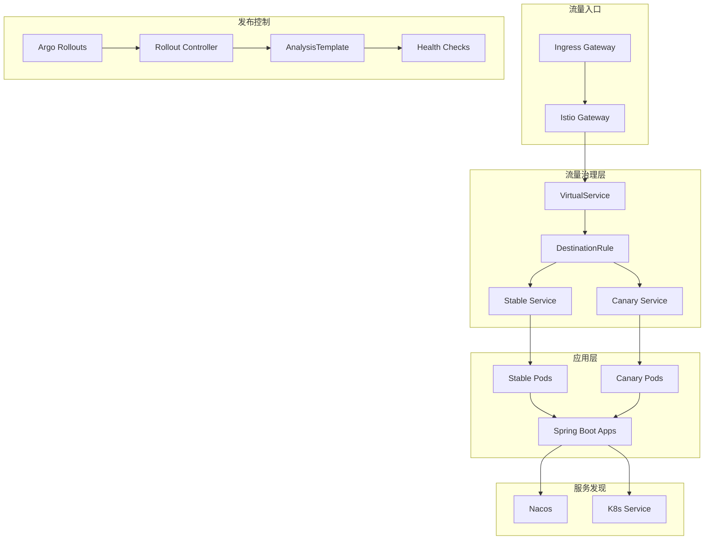

# gray-deploy
[](https://spring.io/projects/spring-boot)
[](https://nacos.io/)
[](https://argoproj.github.io/argo-rollouts/)
[](https://istio.io/)
[](LICENSE)

基于 Spring Boot + Nacos + Argo Rollouts + Istio 的企业级灰度发布解决方案

## 📋 目录

- [项目简介](#-项目简介)
- [核心特性](#-核心特性)
- [技术架构](#-技术架构)
- [快速开始](#-快速开始)
- [部署指南](#-部署指南)
- [灰度发布流程](#-灰度发布流程)
- [配置说明](#-配置说明)
- [故障排查](#-故障排查)
- [最佳实践](#-最佳实践)
- [关注我们](#-关注我们)

## 🚀 项目简介

本项目提供了一个完整的企业级灰度发布解决方案，通过集成 Spring Boot 微服务框架、Nacos 服务注册中心、Argo Rollouts 发布控制器和 Istio 服务网格，实现了安全、可靠、自动化的金丝雀发布能力。

### 解决的核心问题

- **零代码侵入**：业务代码无需修改，完全通过基础设施层实现流量治理
- **服务发现兼容**：完美解决 Nacos 与 K8s 服务发现机制的共存问题
- **灵活流量策略**：支持基于 Header 的定向路由和基于权重的渐进式发布
- **自动化健康检查**：集成 Argo Rollouts AnalysisTemplate，实现自动化的健康状态评估
- **高可用保障**：通过 PodDisruptionBudget 和熔断机制确保服务稳定性

## ✨ 核心特性

### 🎯 智能流量路由
- **基于 Header 的精确路由**：支持通过请求头 `x-canary: true` 将特定流量 100% 路由到金丝雀版本
- **基于权重的渐进式发布**：支持自定义发布步骤，如 10% → 50% → 80% → 100%
- **多环境支持**：开发环境使用 Nacos 服务发现，生产环境使用 Istio 流量治理

### 🔄 自动化发布流程
- **多阶段发布策略**：可配置暂停时间，支持人工确认和自动化验证
- **实时健康检查**：基于 HTTP 探针的自动化健康状态评估
- **自动回滚机制**：健康检查失败时自动触发回滚，保障业务稳定性
- **发布历史追踪**：保留完整的发布历史，支持快速回滚到任意版本

### 🛡️ 生产级保障
- **服务高可用**：PodDisruptionBudget 确保最少可用实例数
- **熔断保护**：Istio outlierDetection 自动隔离异常实例
- **资源限制**：CPU、内存资源限制和请求配置
- **健康检查**：Liveness、Readiness、Startup 三重探针保障

## 🏗️ 技术架构

### 架构组件



### 核心技术栈

| 组件 | 版本 | 说明 |
|------|------|------|
| Spring Boot | 3.2.7 | 微服务框架 |
| Spring Cloud | 2023.0.3 | 微服务治理 |
| Spring Cloud Alibaba | 2023.0.1.0 | 阿里云集成 |
| Nacos | 2.2.4 | 服务注册与配置中心 |
| Istio | 1.18+ | 服务网格 |
| Argo Rollouts | 1.4+ | 高级部署控制器 |
| Kubernetes | 1.25+ | 容器编排平台 |

## 🚀 快速开始

### 前置条件

确保您的环境中已安装以下组件：

- **Kubernetes 集群** (v1.25+)
- **kubectl** 命令行工具
- **Istio** (v1.18+)
- **Argo Rollouts** (v1.4+)
- **Nacos Server** (v2.2.4+)
- **Docker** 和 **Maven** (用于构建)

### 1. 克隆项目

```bash
git clone https://github.com/your-username/gray-deploy.git
cd gray-deploy
```

### 2. 构建服务镜像

```bash
# 构建用户服务
cd user-service
./build-push.sh 1.0.0

# 构建订单服务
cd ../order-service
./build-push.sh 1.0.0
```

> **💡 提示**：修改 `build-push.sh` 中的镜像仓库地址为您自己的私有仓库

### 3. 部署基础设施

```bash
# 创建命名空间
kubectl create namespace gray

# 部署 Nacos (如果尚未部署)
kubectl apply -f nacos-deployment.yaml

# 启用 Istio sidecar 注入
kubectl label namespace gray istio-injection=enabled
```

### 4. 部署应用服务

```bash
# 部署灰度发布配置
kubectl apply -f rollout-istio-deploy.yaml
```

### 5. 验证部署

```bash
# 检查 Rollout 状态
kubectl get rollout -n gray

# 检查 Pod 状态
kubectl get pods -n gray

# 检查服务状态
kubectl get svc -n gray
```

## 📦 部署指南

### 完整部署步骤

#### Step 1: 环境准备

```bash
# 1. 安装 Istio
curl -L https://istio.io/downloadIstio | ISTIO_VERSION=1.18.0 sh -
cd istio-1.18.0
export PATH=$PWD/bin:$PATH
istioctl install --set values.defaultRevision=default

# 2. 安装 Argo Rollouts
kubectl create namespace argo-rollouts
kubectl apply -n argo-rollouts -f https://github.com/argoproj/argo-rollouts/releases/latest/download/install.yaml

# 3. 验证安装
kubectl rollout status deployment/argo-rollouts -n argo-rollouts
```

#### Step 2: 配置服务发现

修改 `user-service/src/main/resources/application.yml`：

```yaml
# 开发环境 - 使用 Nacos 服务发现
order-service:
  url:

# 生产环境 - 使用 K8s Service (由 Istio 接管)
order-service:
  url: http://gray-order-service:8082
```

#### Step 3: 部署应用

```bash
# 1. 构建并推送镜像
cd user-service
./build-push.sh 1.0.1

# 2. 更新 Rollout 中的镜像版本
kubectl set image rollout/gray-user-serivce \
  user-wfl=xxx.xxx.com/gray/user-service:1.0.1 \
  -n gray

# 3. 观察发布过程
kubectl argo rollouts get rollout gray-user-serivce -n gray --watch
```

### 镜像构建配置

#### Dockerfile 示例

```dockerfile
FROM openjdk:17-jre-slim

WORKDIR /app

# 复制应用文件
COPY target/user-service-*.jar app.jar

# 创建日志目录
RUN mkdir -p /app/logs

# 设置时区
ENV TZ=Asia/Shanghai
RUN ln -snf /usr/share/zoneinfo/$TZ /etc/localtime && echo $TZ > /etc/timezone

# 健康检查
HEALTHCHECK --interval=30s --timeout=10s --start-period=60s --retries=3 \
  CMD curl -f http://localhost:8081/actuator/health || exit 1

# 启动应用
ENTRYPOINT ["java", "-jar", "-Dspring.profiles.active=k8s", "/app/app.jar"]
```

## 🎛️ 灰度发布流程

### 发布策略配置

Rollout 支持灵活的发布策略配置：

```yaml
strategy:
  canary:
    steps:
    - setWeight: 20    # 第一阶段：20% 流量到金丝雀
    - pause: {duration: 5m}   # 暂停 5 分钟观察
    - setWeight: 50    # 第二阶段：50% 流量到金丝雀
    - pause: {duration: 10m}  # 暂停 10 分钟验证
    - setWeight: 80    # 第三阶段：80% 流量到金丝雀
    - pause: {duration: 5m}   # 最后暂停确认
    # 自动升级到 100%
```

### 流量路由规则

Istio VirtualService 配置了双重路由策略：

```yaml
http:
# 优先级1：Header 匹配路由
- name: canary-header
  match:
  - headers:
      x-canary:
        exact: "true"
  route:
  - destination:
      host: gray-user-serivce
      subset: canary
    weight: 100

# 优先级2：权重路由（由 Argo Rollouts 控制）
- name: primary
  route:
  - destination:
      host: gray-user-serivce
      subset: stable
    weight: 100  # 动态调整
  - destination:
      host: gray-user-serivce
      subset: canary
    weight: 0    # 动态调整
```

### 发布命令示例

```bash
# 1. 触发新版本发布
kubectl argo rollouts set image gray-user-serivce \
  user-wfl=xxx.xxx.com/gray/user-service:1.0.2 \
  -n gray

# 2. 实时观察发布状态
kubectl argo rollouts get rollout gray-user-serivce -n gray --watch

# 3. 查看发布历史
kubectl argo rollouts history rollout gray-user-serivce -n gray

# 4. 手动确认继续发布
kubectl argo rollouts promote gray-user-serivce -n gray

# 5. 紧急回滚
kubectl argo rollouts undo gray-user-serivce -n gray
```

### 测试金丝雀版本

在用户服务 Pod 中测试基于权重和 Header 的两种流量路由方式：

```bash
# 1. 进入用户服务 Pod
kubectl exec -it -n gray $(kubectl get pod -n gray -l k8s.kuboard.cn/name=gray-user-serivce -o jsonpath='{.items[0].metadata.name}') -- bash

# 2. 测试基于权重的流量分配（按当前发布权重分配到稳定版和金丝雀版）
curl http://gray-user-serivce:8081/user/order-info

# 3. 测试基于 Header 的精确路由（100% 流量到金丝雀版本）
curl -H "x-canary: true" http://gray-user-serivce:8081/user/order-info

# 4. 多次调用观察流量分配效果
for i in {1..10}; do
  echo "=== 调用 $i ==="
  curl http://gray-user-serivce:8081/user/order-info
  sleep 1
done
```

## ⚙️ 配置说明

### 核心配置文件

#### 1. Rollout 配置

| 参数 | 说明 | 推荐值 |
|------|------|--------|
| `replicas` | 副本数 | 3-5 |
| `revisionHistoryLimit` | 保留版本历史 | 10 |
| `setWeight` | 金丝雀流量权重 | 10-50 |
| `pause.duration` | 暂停观察时间 | 5-10m |
| `abortScaleDownDelaySeconds` | 回滚延迟时间 | 30s |

#### 2. Istio 流量治理

| 配置项 | 说明 | 推荐配置 |
|--------|------|----------|
| `loadBalancer` | 负载均衡算法 | ROUND_ROBIN |
| `connectionPool.tcp.maxConnections` | TCP 最大连接数 | 100 |
| `outlierDetection.consecutive5xxErrors` | 熔断阈值 | 3 |
| `outlierDetection.baseEjectionTime` | 熔断时间 | 30s |

#### 3. 健康检查配置

| 探针类型 | 路径 | 延迟时间 | 超时时间 |
|----------|------|----------|----------|
| `livenessProbe` | `/actuator/health/liveness` | 10s | 5s |
| `readinessProbe` | `/actuator/health/readiness` | 10s | 5s |
| `startupProbe` | `/actuator/health` | 10s | 5s |

### 环境变量配置

```yaml
env:
- name: SPRING_PROFILES_ACTIVE
  value: "k8s"
- name: NACOS_SERVER_ADDR
  value: "nacos-server:8848"
- name: NACOS_NAMESPACE
  value: "gray"
```


## 🔧 故障排查

### 常见问题及解决方案

#### 1. 金丝雀发布失败

**问题**：发布过程中健康检查失败

**排查步骤**：
```bash
# 查看 Rollout 状态
kubectl argo rollouts get rollout gray-user-serivce -n gray

# 查看 Pod 日志
kubectl logs -f -n gray deployment/gray-user-serivce

# 查看 AnalysisTemplate 结果
kubectl get analysisrun -n gray
```

**常见原因**：
- 应用启动时间过长
- 健康检查端点配置错误
- 依赖服务不可用

#### 2. 流量路由异常

**问题**：流量没有按照预期路由到金丝雀版本

**排查步骤**：
```bash
# 检查 VirtualService 配置
kubectl get virtualservice -n gray -o yaml

# 检查 DestinationRule 配置
kubectl get destinationrule -n gray -o yaml

# 检查 Istio Pilot 日志
kubectl logs -n istio-system deployment/istio-pilot
```

#### 3. Nacos 服务发现问题

**问题**：服务注册失败或发现异常

**排查步骤**：
```bash
# 检查 Nacos 连接
kubectl exec -it -n gray deployment/gray-user-serivce -- curl http://nacos-server:8848/nacos/v1/ns/instance/list

# 检查服务配置
kubectl get configmap -n gray

# 查看应用日志中的 Nacos 相关错误
kubectl logs -f -n gray deployment/gray-user-serivce | grep nacos
```

### 调试命令

```bash
# 查看 Argo Rollouts 详细状态
kubectl argo rollouts status rollout gray-user-serivce -n gray

# 查看发布事件
kubectl get events -n gray --sort-by='.lastTimestamp'

# 进入 Pod 调试
kubectl exec -it -n gray $(kubectl get pod -n gray -l app=gray-user-serivce -o jsonpath='{.items[0].metadata.name}') -- bash

# 测试服务连通性
kubectl exec -it -n gray deployment/gray-user-serivce -- curl http://gray-order-service:8082/actuator/health
```

## 💡 最佳实践

### 1. 发布策略建议

| 环境 | 发布策略 | 建议配置 |
|------|----------|----------|
| 开发环境 | 快速发布 | setWeight: 50, pause: 2m |
| 测试环境 | 稳定测试 | setWeight: 20, pause: 10m |
| 预生产环境 | 生产模拟 | setWeight: 10, pause: 30m |
| 生产环境 | 保守发布 | setWeight: 5, pause: 15m |

### 2. 健康检查优化

```yaml
# 渐进式健康检查
analysis:
  templates:
  - templateName: http-health-check
  args:
  - name: host
    value: "gray-user-serivce-canary.gray.svc.cluster.local:8081"
  - name: threshold
    value: "99"  # 成功率阈值
  - name: interval
    value: "30s" # 检查间隔
```

### 3. 安全配置

```yaml
# 资源限制
resources:
  requests:
    cpu: '0.1'
    memory: 100Mi
  limits:
    cpu: '1'
    memory: 1024Mi

# 安全上下文
securityContext:
  runAsNonRoot: true
  runAsUser: 1000
  fsGroup: 2000
```

### 4. 配置管理

- 使用 ConfigMap 管理应用配置
- 使用 Secret 管理敏感信息
- 实施配置版本控制
- 建立配置变更审批流程

## 📱 关注我们

<div align="center">
  <p>欢迎关注我的公众号，获取更多技术干货！</p>
  
  <p>👆 扫码关注，获取最新的微服务、云原生技术分享</p>
</div>

